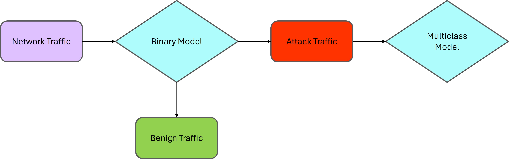

# Network Intrusion Detection Dashboard using XGBoost

## Overview
This project is an end to end **network intrusion detection system** built using an **XGBoost machine learning model**.  
The model is designed to detect **abnormal network traffic**, identify **cyber attacks**, and classify the **type of attack** when malicious behavior is detected.

The primary objective of the model is to **minimise false negatives**, ensuring that attack traffic is rarely misclassified as normal traffic.

The trained model achieves an overall **accuracy of 98 percent**.

---

## Model Description
The system uses a **two stage classification pipeline**.

### Stage 1 Binary Classification
Determines whether the network traffic is  
Normal traffic  
Attack traffic  

### Stage 2 Multiclass Classification
If traffic is classified as an attack, the model further identifies the **specific type of cyber attack**.

The model is implemented using **XGBoost** due to its high performance and robustness for structured network traffic data.

---

## Model Architecture
The model follows the architecture shown below.

---

## Dashboard Features
The Streamlit dashboard provides the following functionality.

* Upload network traffic data in CSV format
* Detect whether traffic is normal or attack behaviour
* Classify the type of cyber attack
* Display prediction metrics and attack distribution
* Download final predictions as a CSV file
* Access analytics and prediction dashboards from a single interface

---

## How to Use the Dashboard

### Step 1 Upload Network Data
Upload your network traffic dataset in **CSV format** using the file uploader.

### Step 2 Run Prediction
Once the data is uploaded, the model automatically  
Predicts whether traffic is normal or malicious  
Classifies the attack type for malicious traffic  

### Step 3 View Results
The dashboard displays  
Prediction results for each network record  
Total normal and attack traffic counts  
Attack category breakdown  

### Step 4 Download Predictions
You can download the **final prediction results as a CSV file** directly from the dashboard.

---

## Dashboard Access
The dashboard links and related configuration files are available inside the **dashboard folder** of this repository.

---

---

## Key Highlights
* XGBoost based intrusion detection system
* Optimised to minimise false negatives
* High accuracy of 98 percent
* Interactive Streamlit dashboard
* Production ready for deployment

---

## Deployment
This application is designed to be deployed directly on **Streamlit Cloud** using `app.py` and `requirements.txt`.

---

## Usage Notes
Ensure that the uploaded CSV file follows the same feature structure used during model training for correct predictions.  
You can use the sample dataset in `data/sample.csv`.